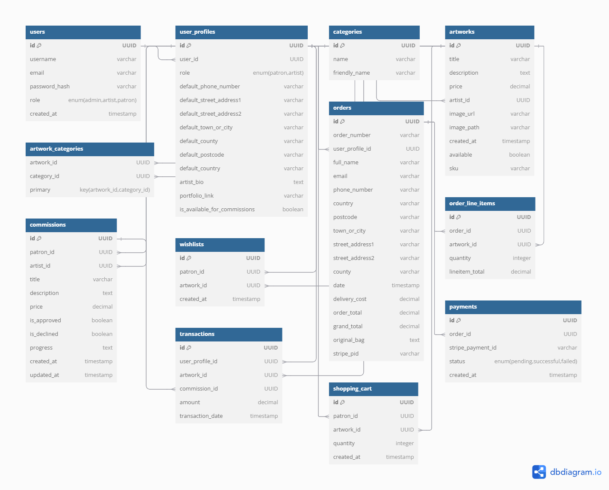

# Artorium

## 📖 Contents
- [User Experience (UX)](#user-experience-ux)
  - [Initial Discussion](#initial-discussion)
  - [Key Information for the Site](#key-information-for-the-site)
  - [User Stories](#user-stories)
    - [Client Goals](#client-goals)
    - [First Time Visitor Goals](#first-time-visitor-goals)
    - [Returning Visitor Goals](#returning-visitor-goals)
    - [Frequent Visitor Goals](#frequent-visitor-goals)
- [Design](#design)
  - [Database](#database)
  - [Colour Scheme](#colour-scheme)
  - [Typography](#typography)
  - [Imagery](#imagery)
  - [Wireframes](#wireframes)
    - [Desktop View Wireframes](#desktop-view-wireframes)
    - [Mobile and Tablet View Wireframes](#mobile-and-tablet-view-wireframes)
- [Features](#features)
  - [General Features on Each Page](#general-features-on-each-page)
  - [Future Implementations](#future-implementations)
  - [Accessibility](#accessibility)
- [Technologies Used](#technologies-used)
  - [Languages Used](#languages-used)
  - [Frameworks, Libraries & Programs Used](#frameworks-libraries--programs-used)
- [Deployment & Local Development](#deployment--local-development)
  - [Deployment](#deployment)
  - [Local Development](#local-development)
    - [How to Fork](#how-to-fork)
    - [How to Clone](#how-to-clone)
- [Testing](#testing)
- [Credits](#credits)
  - [Code Used](#code-used)
  - [Content](#content)
  - [Media](#media)
  - [Acknowledgments](#acknowledgments)

---

## 🏆 User Experience (UX)

### 🖌 Initial Discussion
Artorium is a Django-powered online gallery and e-commerce platform that reimagines the way art lovers collect and experience masterpieces. Inspired by the grandeur of historic palatial homes in the United Kingdom, Artorium offers a curated collection of classic paintings, sculptures, fine arts, and digital works, framed in a way that preserves their historical charm. Patrons can own a piece of history, bringing the timeless elegance of classical and contemporary masterpieces into their own personal "palace." Whether one seeks Renaissance-era paintings, Baroque sculptures, or cutting-edge digital art, Artorium blends tradition with modernity, creating an online space where art is not just admired but truly lived.

### 🎭 Justification for the Concept

Art has always been a cornerstone of human expression, yet access to classic and contemporary masterpieces has remained limited to elite galleries and historic homes. Artorium bridges this gap by offering art enthusiasts an opportunity to experience and own art in an immersive and accessible way.

The platform provides:

- A curated selection of classic paintings, sculptures, and fine arts, allowing patrons to bring home a piece of history.
- The inclusion of digital and contemporary art, ensuring modern artists have a space to showcase their work.
- Luxury presentation of artworks in classic and modern framing styles, catering to refined tastes.
- Accessibility for collectors worldwide, breaking geographical barriers and democratizing art ownership.

By combining tradition with digital innovation, Artorium redefines the way people experience, appreciate, and purchase art.

### 🔑 Key Information for the Site
- User authentication with role selection (**Artists, Patrons, Admins**)
- Secure payment processing via **Stripe**
- Artwork management with **CRUD operations**
- Wishlist functionality for patrons
- Order tracking and history

## 📖 User Stories

### 🎨 Client Goals
- Navigate the site easily
- Register and log in
- Browse and purchase artworks
- Manage their wishlist
- Checkout securely via Stripe

### 👀 First Time Visitor Goals
- Learn about available artworks
- Browse categories
- Create an account

### 🔄 Returning Visitor Goals
- View personalized recommendations
- Manage past orders
- Add more artworks to the wishlist

### 🚀 Frequent Visitor Goals
- Stay updated with new artworks
- Manage past purchases and track deliveries

## 🎨 Design

### 🏛️ Database
- **User Model**: Handles authentication and roles
- **Artwork Model**: Stores artwork details
- **Order Model**: Tracks purchases

#### 📌 Models Diagram


### 🎨 Colour Scheme
A modern, visually appealing color palette.

### 🔠 Typography
- **Primary Font**: Lato
- **Accent Font**: Pacifico

### 📸 Imagery
- High-quality images uploaded by artists
- Aesthetic branding elements

### 📐 Wireframes
#### 🖥 Desktop View Wireframes
*![Placeholder for Desktop Wireframes]*
#### 📱 Mobile and Tablet View Wireframes
*![Placeholder for Mobile Wireframes]*

## 🌟 Features

### 🎯 General Features on Each Page
- Home page with featured artworks
- Search and filter functionalities
- Secure checkout via Stripe
- Role-based authentication system

### 🚀 Future Implementations
- **Commissions Feature**
- **User reviews & ratings**
- **Social media integration**
- **Dark mode toggle**

### ♿ Accessibility
- Semantic HTML for screen readers
- Sufficient color contrast
- Alt attributes for images

## 🛠 Technologies Used

### 📌 Languages Used
- **HTML, CSS, JavaScript, Python (Django)**

### ⚙️ Frameworks, Libraries & Programs Used
- **Django, Bootstrap, Stripe, PostgreSQL, Git & GitHub, Heroku**

## 🚀 Deployment & Local Development

### 🌍 Deployment
1. Set up **PostgreSQL**
2. Configure **environment variables**
3. Deploy to **Heroku**

### 💻 Local Development
#### 🔁 How to Fork
1. Go to the repository
2. Click on "Fork"
#### 🖥 How to Clone
1. Copy the repository URL
2. Run:
   ```sh
   git clone <repository-url>
   ```

## ✅ Testing

### 🛠 Manual Testing
- Testing authentication flows
- Ensuring CRUD operations work as expected

### 🤖 Automated Testing
- Unit tests for authentication and payment workflows

## 🎉 Credits

### 📝 Code Used
- Various Django libraries and frameworks

### 📚 Content
- Developed by **Jake**

### 🖼 Media
- Artwork images uploaded by artists

### 🙌 Acknowledgments
- Code Institute for Django guidance
- Open-source communities for resources

---

**This README serves as the official documentation for Artorium, ensuring clarity for developers, artists, and patrons alike.** 🎨🚀

