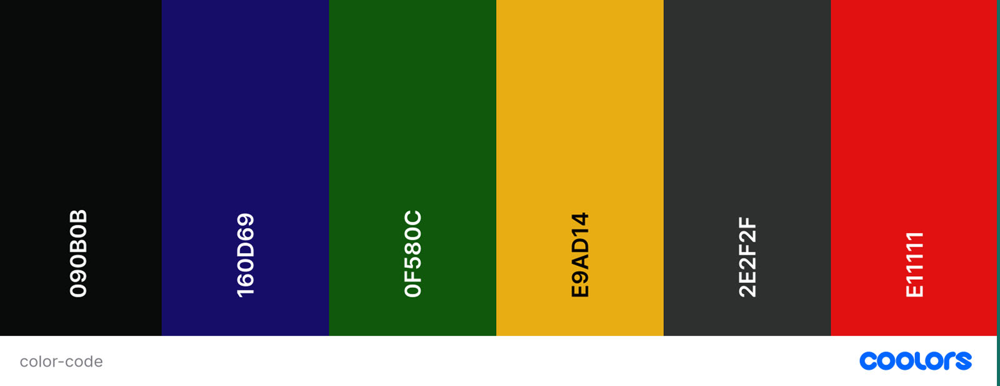
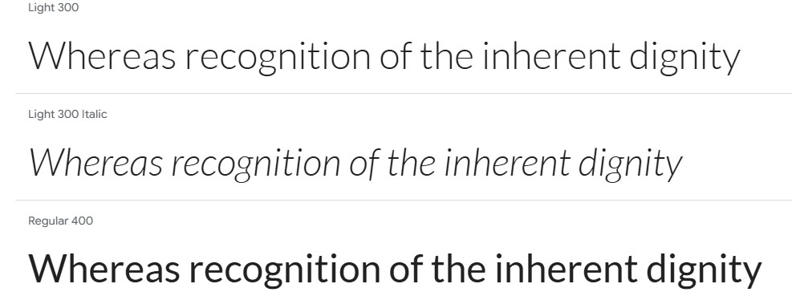
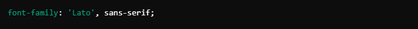
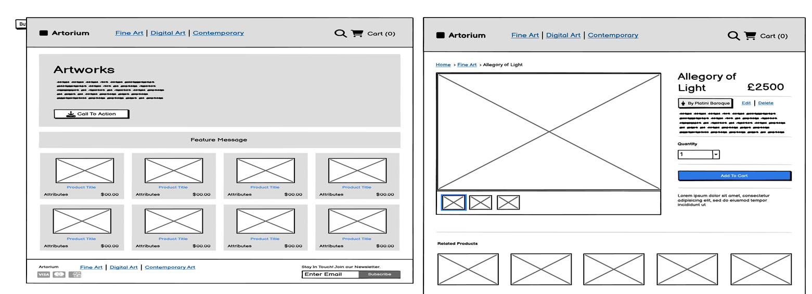
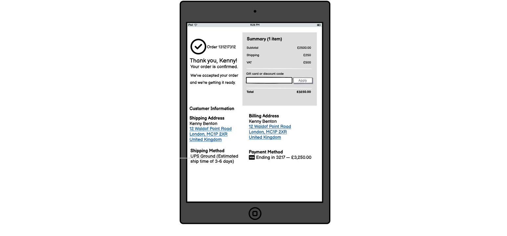
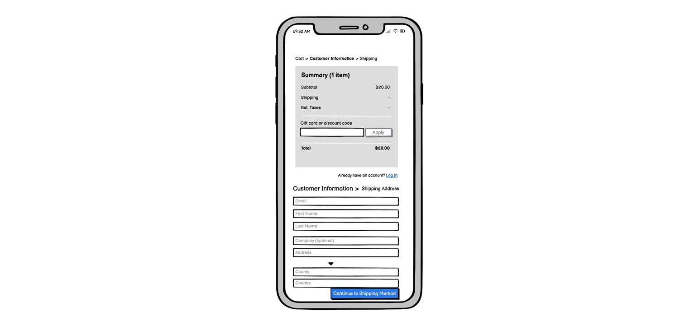
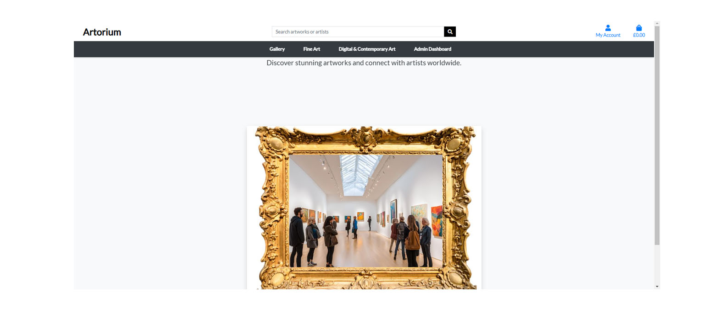
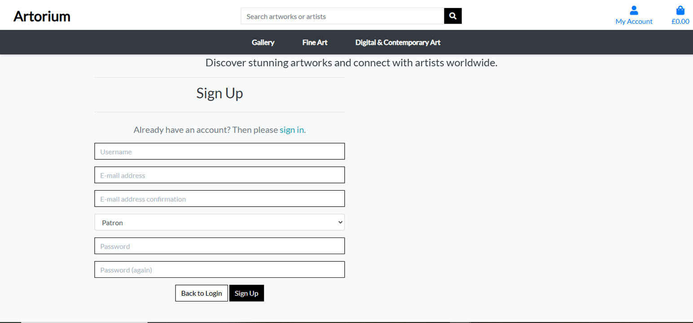
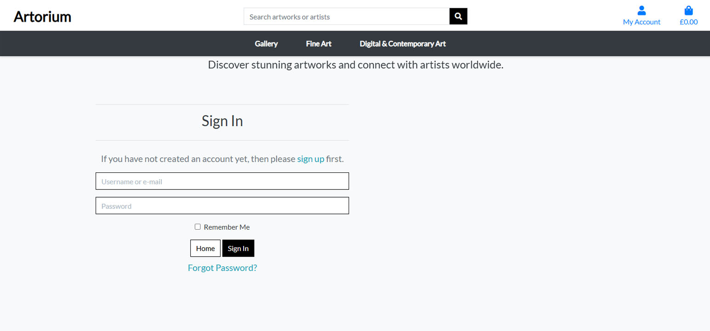
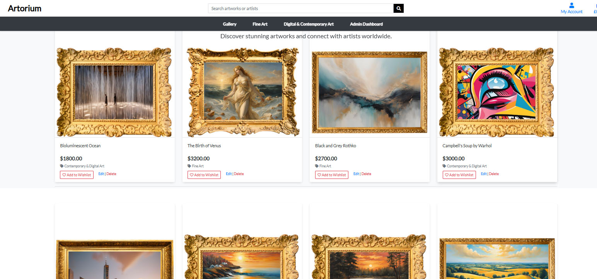

# Artorium

Artorium is a Django-powered online gallery and e-commerce platform that reimagines the way art lovers collect and experience masterpieces. Inspired by the grandeur of historic palatial homes in the United Kingdom, Artorium offers a curated collection of classic paintings, sculptures, fine arts, and digital works, framed in a way that preserves their historical charm. Patrons can own a piece of history, bringing the timeless elegance of classical and contemporary masterpieces into their own personal "palace." Whether one seeks Renaissance-era paintings, Baroque sculptures, or cutting-edge digital art, Artorium blends tradition with modernity, creating an online space where art is not just admired but truly lived.

The site serves as a digital marketplace where artists can showcase and sell their artwork, patrons can browse and purchase unique pieces, and administrators can manage transactions, commissions, and site content.

Built with **Django, Python, HTML, CSS, JavaScript, PostgreSQL, and Stripe integration**, Artorium provides a seamless and secure experience for both buyers and sellers. The platform supports **user authentication, artwork management, wishlist functionality, commission requests, and online payments**.


### Justification for the Concept

Art has always been a cornerstone of human expression, yet access to classic and contemporary masterpieces has remained limited to elite galleries and historic homes. Artorium bridges this gap by offering art enthusiasts an opportunity to experience and own art in an immersive and accessible way.

##  User Experience (UX)

### Initial Discussion

The platform will provide:

- A curated selection of classic paintings, sculptures, and fine arts, allowing patrons to bring home a piece of history.
- The inclusion of digital and contemporary art, ensuring modern artists have a space to showcase their work.
- Luxury presentation of artworks in classic and modern framing styles, catering to refined tastes.
- Accessibility for collectors worldwide, breaking geographical barriers and democratizing art ownership.

By combining tradition with digital innovation, Artorium redefines the way people experience, appreciate, and purchase art.

### Key Information for the Site
- User authentication with role selection (**Artists, Patrons, Admins**)
- Secure payment processing via **Stripe**
- Artwork management with **CRUD operations**
- Wishlist functionality for patrons
- Order tracking and history

## Features

### Artwork Management
- Admins and artists can **add, edit, update, and delete** artworks.
- Artworks include: **title, description, price, category, availability, and image**.
- Patrons can **view and purchase** artworks.
- **Secure payment processing** with Stripe.

### Commissions
- Patrons can **submit commission requests** with details and preferences.
- Artists/Admins can **accept or decline** commissions.
- Artists provide **progress updates** on commissions.

### Wishlist
- Patrons can **add artworks** to a personal wishlist.
- Option to **remove items** from the wishlist.

### User Roles & Permissions
- **Admin**: Full access to manage artworks, commissions, payments, and site settings.
- **Artist**: Can manage their own artworks and commissions.
- **Patron**: Can browse, purchase, and request commissions.

### Dashboard Views
- **Admin Dashboard**: Overview of sales, commissions, and artwork management.
- **Artist Dashboard**: Manage personal artworks and commissions.
- **Patron Dashboard**: View order history, wishlist, and commissions.

  
*Placeholder for a screenshot of the admin or user dashboard*


## User Stories

## Features

### Artwork Management
- Admins and artists can **add, edit, update, and delete** artworks.
- Artworks include: **title, description, price, category, availability, and image**.
- Patrons can **view and purchase** artworks.
- **Secure payment processing** with Stripe.

### Commissions
- Patrons can **submit commission requests** with details and preferences.
- Artists/Admins can **accept or decline** commissions.
- Artists provide **progress updates** on commissions.

### Wishlist
- Patrons can **add artworks** to a personal wishlist.
- Option to **remove items** from the wishlist.

### User Roles & Permissions
- **Admin**: Full access to manage artworks, commissions, payments, and site settings.
- **Artist**: Can manage their own artworks and commissions.
- **Patron**: Can browse, purchase, and request commissions.

### Dashboard Views
- **Admin Dashboard**: Overview of sales, commissions, and artwork management.
- **Artist Dashboard**: Manage personal artworks and commissions.
- **Patron Dashboard**: View order history, wishlist, and commissions.

### Frequent Visitor Goals
- Stay updated with new artworks
- Manage past purchases and track deliveries

Detailed user stories for this project are documented separately. Click the link below to view them:

[View User Stories](user_stories.md)

## Project Goals

- The primary goal is to create an **easily manageable** and **intuitive** platform that enhances the experience of both **artists and patrons** while streamlining administrative tasks.
- Designed with a **user-centric approach**, the platform should cater to the needs of **artists, patrons, and administrators** by offering a seamless and efficient interface.
- The project aims to **demonstrate proficiency** in full-stack development, focusing on **CRUD (Create, Read, Update, Delete) functionality** integrated with a PostgreSQL database.
- The site should **securely handle transactions** through **Stripe** for artwork purchases and commission payments.
- The platform will provide **role-based access control**, ensuring **secure** and **efficient** management of artworks, orders, commissions, and user interactions.
- The system should be **scalable** and **adaptable**, with potential for future enhancements such as analytics, notifications, and multi-language support.
- The final implementation will **showcase best practices** in **Django development**, **database management**, **API integration**, and **responsive UI design**.


## Design

### Colour Scheme

The color palette for **Artorium** has been carefully selected to reflect a **modern, artistic, and elegant** aesthetic. The primary colours include:

- **Deep Blue** – Represents creativity, depth, and artistic expression.
- **Gold Accents** – Symbolizes luxury and exclusivity, highlighting important elements.
- **Soft Neutrals** – Provide a clean and balanced background to ensure artworks remain the focal point.

Each color is used with **intentionality** to enhance the user experience:

- **Success messages** are styled in **deep green** to indicate positive actions.
- **Delete and cancel actions** use **dark red**, signaling potential irreversible changes.
- **Call-to-action buttons** and **hover effects** incorporate a **golden hue** to draw attention without overwhelming the interface.


  

This version aligns with Artorium's theme, keeping it clean, professional, and visually appealing.


### 🖋 Typography

The **typography** for **Artorium** has been carefully selected to ensure **elegance, readability, and accessibility** while complementing the artistic nature of the platform.

- **Primary Font:** *Lato* – Used for headings and branding elements, giving a **sophisticated, artistic feel**.
- **Lato is a **sans-serif typeface** known for its **balanced letterforms**, making it ideal for both headings and body text.
- Both fonts are sourced from **Google Fonts** for easy integration and scalability.

### Accessibility Considerations
- The default font size is set to **16px**, ensuring readability while maintaining a visually appealing layout.
- No font size is smaller than **12px**, aligning with the **Penn State University Accessibility and Usability Guidelines**.
- The typography setup follows **WCAG (Web Content Accessibility Guidelines)**, allowing text to be zoomed **up to 200%** without losing contrast or breaking the layout.
- Font weights and spacing have been **optimized for readability**, making the platform more accessible to users with **dyslexia and visual impairments**.



Typography Example



CSS Reference

This **incorporates Lato as the primary font**, ensuring a **modern and readable** experience for **Artorium**.


### Imagery

The **imagery and branding** within **Artorium** are carefully curated to enhance the platform’s **aesthetic appeal and user experience**. Visual elements are designed to **highlight artworks**, maintain a **clean interface**, and provide **seamless navigation**.

- The **design elements** are crafted using **Canva**, ensuring a **professional and cohesive visual identity**.
- **High-quality images** are used to showcase artworks, providing an **immersive experience** for patrons.
- **Subtle box shadows** are applied to images and elements, echoing modern **gallery presentation styles**.
- The **interface maintains a refined, neutral colour palette** to keep the focus on the artwork.

### UI & Interaction Design
- **Links** have their underlines removed for a **cleaner look**, but reappear when active for **clarity**.
- **Hover and focus styles** are applied to all interactive elements, ensuring a **clear and engaging user experience**.
- **Icons from Font Awesome** are used throughout the site to provide **meaningful visual cues** and improve **accessibility**.
- **Button colors** are used **intentionally**:
  - **Dark red** for **Delete** or **Cancel** actions, ensuring users recognize critical actions.
  - **Gold accents** for **call-to-action buttons**, drawing attention to key interactions.

  

"The Alligory of Light" framed in elaborate, gilded frames that reflect their historical and artistic importance

### Wireframes

At the **start of this project**, a series of **wireframes** were created to outline the **initial design concepts**. These wireframes helped in structuring the layout, user navigation, and **overall user experience**.

- The wireframes serve as **early design blueprints** and do not fully reflect the **final implementation**.
- Both **desktop and mobile versions** were considered to ensure a **responsive and accessible** experience across all screen sizes.

#### Wireframes Overview:
- **Homepage** – Displaying featured artworks and navigation.
- **Gallery Page** – A categorized view of artworks.
- **Artwork Detail Page** – A single artwork page with purchase and commission options.
- **User Dashboard** – Different views for **Admins, Artists, and Patrons**.
- **Shopping Cart & Checkout** – Secure and intuitive purchasing process.

  
*Gallery and artworks detail pages*

  
*Tablet design for the checkout page*

  
*Mobile design for the checkout page*


## Features

### Home Page
This feature allows users to:
- **Explore artworks** through an engaging **gallery display** with images and descriptions.
- **View featured artworks** that highlight new, popular, or exclusive pieces.
- **Navigate categories** to browse artworks by different styles, mediums, and artists.
- **Access contact details** and platform information for inquiries and support.

  
*The homepage*

---

### User Registration
This feature allows users to:
- **Sign up for an account** by providing essential details:
- **Email**
- **Username**
- **Securely enter passwords twice** to prevent typos.
- **Store personal details** for future purchases and interactions.
- **Track order history** and commission requests.

  
*The registration page*

---

### Log In
This feature allows users to:
- **Log in with an email or username and password**.
- **Remember login credentials** for easier access in future visits.
- **Reset password** if forgotten.
- **Access the user profile** to manage account details.
- **View, edit, or delete account information**.

  
*The login page*

---

### Gallery & Artwork Categories
This feature allows users to:
- **Browse all artwork categories** through a structured navigation menu.
- **View detailed artwork listings** including:
  - **Title, description, price, availability, and artist details**.
  - **High-quality images** showcasing the artwork.
- **Click on an artwork card** to open its **detailed view page**.

  
*The gallery page*

---

### Artwork Detail Page
This feature allows users to:
- **View comprehensive details** about an artwork, including:
  - **Category** (e.g., Painting, Sculpture, Digital Art).
  - **Price** of the artwork.
  - **Image preview** for better visualization.
- **Purchase artwork directly** via a **"Buy Now"** button.

---

### Admin: Create, Edit, and Delete Artworks
This feature allows the **Admin** to:
- **Add new artworks** to the gallery.
- **Edit existing artwork details** to update price, description, or availability.
- **Delete artworks** that are no longer available.
- **Upload images** directly to the platform.

---

### Wishlist
This feature allows users to:
- **Save favorite artworks** to a personal wishlist.
- **Easily access** and review saved items.
- **Remove artworks** from the wishlist when no longer interested.

---

### Shopping Cart & Checkout
This feature allows users to:
- **Add artworks to a shopping cart** before purchasing.
- **Remove items** from the cart before completing a transaction.
- **Proceed to checkout** and make a secure payment using **Stripe**.
- **Receive an order confirmation** after a successful purchase.
---

### Commissions
This feature allows users to:
- **Request a custom commission** by providing details and preferences.
- **Artists/Admins can review and accept/decline commissions**.
- **Artists can update commission progress**, keeping the patron informed.

---

### Dashboard Views
#### **Admin Dashboard**
- **Manage all artworks, users, and orders**.
- **Oversee commissions** and progress tracking.
- **View sales analytics** and revenue reports.

#### **Artist Dashboard**
- **Manage personal artworks** and commission requests.
- **Update artwork availability** and pricing.

#### **Patron Dashboard**
- **View past orders, wishlist, and commissions**.
- **Manage profile details** and preferences.

---

## Future Enhancements
- **Artist Rating System** – Patrons can rate and review artists.
- **Email Notifications** – Automatic order and commission updates.
- **Analytics Dashboard** – Insights for Admins on sales trends.
- **Multi-language Support** – Expanding accessibility for global users.

[ Back to Top](#)

## Future Features

There are **several future enhancements** planned for **Artorium**, aiming to improve **user experience, platform scalability, and artist engagement**.

- **Unimplemented user stories** at the project deadline will be stored in the **product backlog**, pending future development.
- **GitHub milestones** will be used to track progress and prioritize upcoming features.

### Planned Features for Future Releases:
- **Artist Rating System** – Patrons can rate and review artists based on their commission experience.
- **Email Notifications** – Automated updates for order confirmations, commission progress, and platform announcements.
- **Advanced Search & Filters** – Enhanced search functionality allowing patrons to filter artworks by price range, medium, artist, and popularity.
- **Bulk Artwork Uploads** – Artists can upload multiple artworks at once, improving efficiency.
- **Auction Feature** – Introduction of a bidding system for limited edition or exclusive artworks.
- **Wishlist Sharing** – Users can share their wishlist with friends or family.
- **Multi-language Support** – Expanding accessibility for global users.

---

## Defensive Design

In **Artorium**, **defensive design principles** are implemented to enhance **user experience, system reliability, and security**. Users receive **clear and informative feedback** at every step to prevent confusion and **ensure a smooth browsing and purchasing experience**.

### Success Messages:
- Upon **successful form submissions or operations**, users receive **clear confirmation messages**, reassuring them that their action was successfully completed.
- Examples:
  - **"Your artwork has been added to the gallery successfully!"**
  - **"Payment processed successfully. Your order is now confirmed!"**
  - **"Commission request submitted! The artist will review your request soon."**

### Error Handling:
- When **forms contain invalid data**, users are prompted with **error messages** explaining the issue and how to resolve it.
- If a **purchase or transaction fails**, users receive **immediate feedback** with an explanation of why it failed (e.g., insufficient funds, incorrect payment details).

### User-Friendly Design Choices:
- **Confirmation dialogs** before deleting important data (e.g., "Are you sure you want to delete this artwork?").
- **Accessible UI elements** with proper hover and focus states.
- **Clear call-to-action buttons** with distinct colors for actions like "Buy Now" vs. "Delete Artwork."

[🔝 Back to Top](#)


## Database Design

This project uses a **PostgreSQL database**, optimized for handling **artwork listings, user roles, commissions, and transactions**.

### Entity-Relationship Diagram (ERD)
Below is a **simplified schema** representing how different database models interact within **Artorium**:


*Model Diagram*

The **core database models** include:
- **User Model** (Admin, Artist, Patron)
- **Artwork Model** (Title, Description, Price, Category, Image, Availability)
- **Order Model** (User, Artwork, Payment Status, Timestamps)
- **Wishlist Model** (User, Artwork)
- **Commission Model** (User, Artist, Status, Progress Updates)

---

## Agile Development Process

The development of **Artorium** follows **Agile principles**, focusing on:
- **Flexibility** in feature iterations.
- **Continuous improvement** based on feedback.
- **Milestone-based planning**, prioritizing **core functionalities** before expanding into advanced features.

### 🔍 **Bug Tracking & Backlog Management**
- **Issues are logged** and tracked via GitHub Project Boards.
- **Bugs and improvements** are revisited based on severity and impact.
- **User feedback** is actively incorporated into development cycles.
---

## MoSCoW Prioritization
To **effectively manage development priorities**, tasks are categorized using the **MoSCoW method**:

- **MUST HAVE** – Core functionalities critical for platform operations.
- **SHOULD HAVE** – Important features that improve usability but are not blockers.
- **COULD HAVE** – Enhancements that add value but can be deferred.
- **WON'T HAVE** – Features identified for potential future releases.

---

## Technologies Used

### **Languages**
- **HTML5** – Structuring the frontend UI.
- **CSS3** – Styling and layout design.
- **JavaScript** – Enhancing interactivity.
- **Python 3.12.3** – Backend logic using Django.

### **Development Tools**
- **GitPod & Visual Studio Code** – Primary IDE for building the application.

### **Version Control**
- **Git** – Used for version control and code tracking.
- **GitHub** – Code storage and issue tracking.

### **Database Design**
- **DBDiagram** – Used to create **Entity-Relationship Diagrams (ERDs)**.

### **Responsive Design**
- **Am I Responsive** – Used to check UI responsiveness.
- **Responsinator** – Further tested mobile compatibility.

### **Documentation & Optimization**
- **Shields.io** – Used for creating GitHub project badges.
- **Lighthouse** – Ensured **performance, SEO, and accessibility** compliance.

---

## Site Design

### **Fonts & Icons**
- **Google Fonts** – Used to implement `Lato` for typography:
  ```html
  <link rel="stylesheet" href="https://fonts.googleapis.com/css?family=Lato&display=swap">


## UI & Design Assets

- **Font Awesome** – Used for **UI icons** across the platform.
- **Canva** – Created **branding assets and graphics** for Artorium.

### 🖼 Image Optimization
- **TinyPNG** – Used to **compress images** for better **performance and faster loading times**.
- **Coolors** – **Color palette selection** for **UI consistency** and visual appeal.

---

## Packages & Dependencies

| Package | Purpose |
|---------|---------|
| **Django** | Web framework |
| **django-allauth** | Authentication |
| **django-crispy-forms** | Frontend form rendering |
| **dj-database-url** | Database configuration |
| **gunicorn** | WSGI HTTP server |
| **cloudinary** | Cloud storage for media files |
| **django-cloudinary-storage** | Cloud storage for Django |
| **psycopg2** | PostgreSQL database adapter |
| **whitenoise** | Static file serving for WSGI apps |

---

## Hosting & Deployment

### **Heroku Deployment**
- **Heroku** is used for **live deployment** of **Artorium**.

### **Local Deployment**
To set up the project locally, follow these steps:

```bash
git clone https://github.com/yourusername/artorium.git
cd artorium
pip install -r requirements.txt
python manage.py migrate
python manage.py runserver


## Testing

### **Manual Testing**
- **Cross-browser testing**: Ensured compatibility across:
  - **Google Chrome**
  - **Mozilla Firefox**
  - **Microsoft Edge**
- **Mobile responsiveness testing**: Verified seamless functionality on:
  - **Android devices**
  - **iOS devices**

### **Bug Tracking**
- All identified issues are **documented and tracked** in **GitHub Project Boards** for resolution.

---

## **Known Bugs**
- **One identified issue**:
  - The **truncatewords function** on the **artwork category page** causes **inconsistent spacing** between artwork descriptions.
- If any additional issues are found, they will be added to the **GitHub issues tracker**.

**If you find a bug, please report it** so it can be fixed promptly.

---

## **Credits & Acknowledgments**

Throughout the development of **Artorium**, numerous **resources, blogs, and tutorials** provided guidance and inspiration.

### **Development Resources**
- **[Django Documentation](https://docs.djangoproject.com/)** – Core **framework reference**.
- **[Bootstrap](https://getbootstrap.com/)** – Used for **styling and responsive design**.
- **[MDN Web Docs](https://developer.mozilla.org/)** – Used for **JavaScript best practices**.

### **Tutorials & References**
- **[Django Recipe Sharing Tutorial](#)** – Used for **inspiration and best practices**.
- **[Net Ninja’s Django Guide](https://www.youtube.com/c/TheNetNinja)** – Helped in **structuring the backend logic**.

### **Imagery & Assets**
- **[Pexels](https://www.pexels.com/)** & **[Pixabay](https://www.pixabay.com/)** – Provided **royalty-free artwork images**.

### **Special Thanks**
- The **Code Institute Community** for **support and collaboration**.
- My **mentor and peers** for **valuable guidance throughout development**.
- My **family & friends** for their **continuous encouragement**.

---

## **License**
This project is **licensed under the MIT License**.

---

## **Final Thoughts**

**Artorium** is a **robust and scalable** platform for **digital art transactions**. Designed with **accessibility, security, and flexibility** in mind, this project serves as a **foundation for future growth and expansion**.

[🔝 Back to Top](#)


