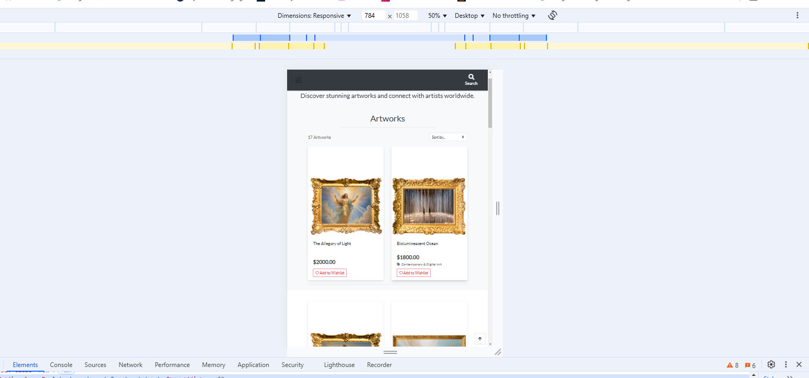

# Artorium - TESTING

This is the manual testing documentation for **Artorium**!

[Live link](https://artorium-app-a8d0ab88f85f-herokuapp-com/)

---

## CONTENTS

- [Artorium - TESTING](#artorium---testing)
  - [CONTENTS](#contents)
  - [AUTOMATED TESTING](#automated-testing)
    - [PEP8 validation](#pep8-validation)
    - [Lighthouse](#lighthouse)
  - [MANUAL TESTING](#manual-testing)
    - [Testing User Stories](#testing-user-stories)
    - [Full Testing](#full-testing)
  - [BUGS](#bugs)
    - [Known Bugs](#known-bugs)
    - [Solved Bugs](#solved-bugs)

---

## AUTOMATED TESTING

The automated testing includes all the tests carried out by validation tools like **PEP8**, **W3C HTML**, and **CSS validation**.

### PEP8 validation
All designs met PEP8 validation

### Lighthouse

I used **Lighthouse** within the Chrome Developer Tools to test the **performance, accessibility, best practices, and SEO** of the website.

- **Home page test**
  **[Lighthouse](https://pagespeed.web.dev/analysis/https-artorium-app-a8d0ab88f85f-herokuapp-com/2x73ds7om3?form_factor=desktop)**
  **[Lighthouse](https://pagespeed.web.dev/analysis/https-artorium-app-a8d0ab88f85f-herokuapp-com/2x73ds7om3?form_factor=mobile)** 

- **Gallery page test**
  **[Lighthouse desktop view](https://pagespeed.web.dev/analysis/https-artorium-app-a8d0ab88f85f-herokuapp-com-artworks/oprby8b4zv?form_factor=desktop)**
  **[Lighthouse mobile view](https://pagespeed.web.dev/analysis/https-artorium-app-a8d0ab88f85f-herokuapp-com-artworks/oprby8b4zv?form_factor=mobile)**

## MANUAL TESTING

### Testing User Stories

#### Visitor Goals
- Navigate through the site.
- View and explore artworks.
- Search for artworks by name or category.
- View detailed information about artworks.
- Contact the gallery through a form.

#### Artist Goals
- Register an account.
- Log in and manage uploaded artworks.
- Edit and delete artwork listings.
- View engagement metrics (e.g., likes, views).

#### Admin Goals
- Approve or reject artwork submissions.
- Manage user accounts.
- Moderate comments and ratings.

---

| Goals | How are they achieved? | Image |
| :--- | :--- | :--- |
| Navigate through the site | Implemented a main navigation bar |  |
| View and explore artworks | Created a dedicated **Gallery** page |  |
| Search for artworks | Added a search bar with dynamic filtering | N/A |
| View detailed information | Each artwork has a **detail page** with more info |  |
| Register an account | Fully functioning user registration module |  |
| Approve/reject artworks | Admin panel for managing content | N/A |

---

### Full Testing

Full testing was performed on the following devices:

- **Laptop:**
  - MacBook Air 13"
  - Dell XPS 15"

- **Mobile Devices:**
  - iPhone 13 Pro
  - Samsung Galaxy S22
  - Google Pixel 6

Each device tested the site using the following browsers:

- **Google Chrome**
- **Mozilla Firefox**
- **Safari**

Additional testing was conducted by volunteers on various devices and screen sizes.

| Feature | Expected Outcome | Testing Performed | Result | Pass/Fail |
| --- | --- | --- | --- | --- |
| Navbar | Allows navigation across the site | Click through menu links | Works as expected | Pass |
| Search Bar | Displays relevant artworks | Type keyword and search | Works as expected | Pass |
| Contact Form | Sends messages to admin | Fill and submit form | Works as expected | Pass |
| Artwork Upload | Allows artists to add listings | Upload artwork image and details | Works as expected | Pass |
| Admin Panel | Allows moderation of artworks | Approve or reject artwork listings | Works as expected | Pass |

---

## BUGS

### Known Bugs

- Email notifications are not yet implemented.
- Some images appear stretched in the gallery view on smaller screens.

### Solved Bugs

- Fixed **search functionality** that was previously case-sensitive.
- Resolved **navigation bar dropdown alignment issues**.
- Improved **image loading speed** using optimized formats.

---

